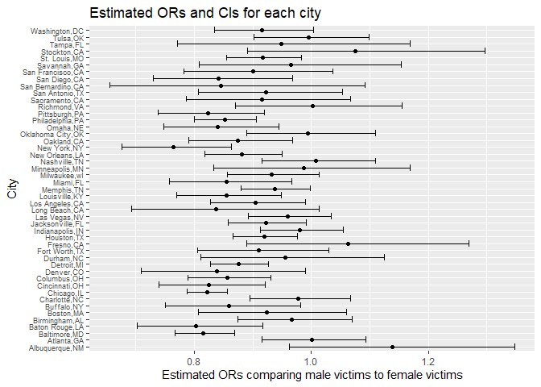

p8105_hw6_hw2861
================
Hongmiao Wang
2022-12-01

## Problem 2

The Washington Post has gathered data on homicides in 50 large U.S.
cities.

### Create a city_state variable and a binary variable indicating whether the homicide is solved.

``` r
homicide_df = 
  read_csv("./Data/homicide-data.csv") %>% 
  mutate(
    city_state = str_c(city, state, sep = ","),
    victim_age = as.numeric(victim_age),
    status = case_when(
      disposition == "Closed without arrest" | disposition == "Open/No arrest"   ~ 0,
      TRUE ~ 1)) %>% 
    filter(!city_state %in% c("Tulsa,AL", "Dallas,TX", "Phoenix,AZ", "Kansas City,MO"))%>% 
    filter(victim_race == "White"| victim_race == "Black")
```

    ## Rows: 52179 Columns: 12
    ## ── Column specification ────────────────────────────────────────────────────────
    ## Delimiter: ","
    ## chr (9): uid, victim_last, victim_first, victim_race, victim_age, victim_sex...
    ## dbl (3): reported_date, lat, lon
    ## 
    ## ℹ Use `spec()` to retrieve the full column specification for this data.
    ## ℹ Specify the column types or set `show_col_types = FALSE` to quiet this message.

    ## Warning in mask$eval_all_mutate(quo): NAs introduced by coercion

The binary variable indicating whether the homicide is solved is called
” status”. Some cities have been omitted.

### For the city of Baltimore, MD, use the glm function to fit a logistic regression.

-   Resolved vs unresolved as the outcome and victim age, sex and race
    as predictors.

``` r
balt_glm = 
  homicide_df %>% 
  filter(city_state == "Baltimore,MD") %>% 
  glm(status ~ victim_age + victim_race + victim_sex, data = ., family = binomial())  


  broom::tidy(balt_glm) %>% 
  mutate(
    OR = exp(estimate),
    CI_lower = exp(estimate - 1.96 * std.error),
    CI_upper = exp(estimate + 1.96 * std.error)) %>% 
  select(term, OR, CI_lower,CI_upper) %>% 
  filter(term == "victim_sexMale") %>% 
  knitr::kable(digits = 3)
```

| term           |    OR | CI_lower | CI_upper |
|:---------------|------:|---------:|---------:|
| victim_sexMale | 0.426 |    0.325 |    0.558 |

### Now run glm for each of the cities in my dataset

-   Extract the adjusted odds ratio (and CI) for solving homicides
    comparing male victims to female victims.

``` r
city_glm = 
  homicide_df %>% 
  group_by(city_state)%>% 
  nest() %>% 
  mutate(
    models= map(data, ~glm(status ~ victim_age + victim_race + victim_sex, data = .x)),
    results = map(models, broom::tidy)) %>% 
  select(city_state, results) %>% 
  unnest(results) %>% 
  mutate(
    OR = exp(estimate),
    CI_lower = exp(estimate - 1.96 * std.error),
    CI_upper = exp(estimate + 1.96 * std.error)) %>% 
  select(term, OR, CI_lower,CI_upper) %>% 
  filter(term == "victim_sexMale") %>% 
  select(city_state, term, OR, CI_lower,CI_upper) 
```

    ## Adding missing grouping variables: `city_state`

``` r
is.data.frame(city_glm)
```

    ## [1] TRUE

I created a dataframe with estimated ORs and CIs for each city. The
adjusted odds ratio (and CI) is about solving homicides comparing male
victims to female victims.

### Create a plot that shows the estimated ORs and CIs for each city.

``` r
city_glm %>% 
  mutate(city_state = fct_reorder(city_state, OR))%>% 
  ggplot(aes(x = OR, y = city_state)) + 
  geom_point() + 
  geom_errorbar(aes(xmin = CI_lower, xmax = CI_upper)) + 
  labs(title = "Estimated ORs and CIs for each city", 
       y = "City", 
       x = "Estimated ORs comparing male victims to female victims")+ 
   theme(axis.text.y = element_text(size=7))
```

<!-- -->
