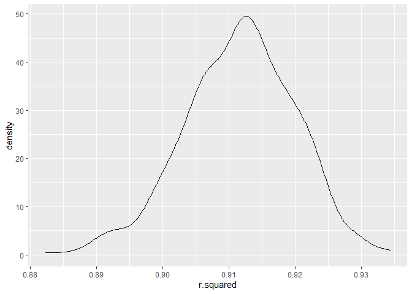
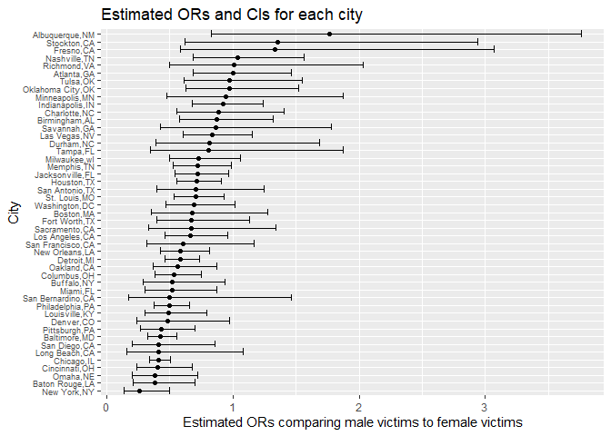
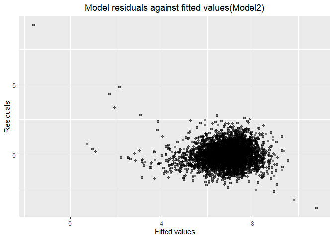

p8105_hw6_hw2861
================
Hongmiao Wang
2022-12-01

## Problem 1

To obtain a distribution for $\hat{r}^2$, we’ll follow basically the
same procedure we used for regression coefficients: draw bootstrap
samples; the a model to each; extract the value I’m concerned with; and
summarize. Here, we’ll use `modelr::bootstrap` to draw the samples and
`broom::glance` to produce `r.squared` values.

``` r
weather_df = 
  rnoaa::meteo_pull_monitors(
    c("USW00094728"),
    var = c("PRCP", "TMIN", "TMAX"), 
    date_min = "2017-01-01",
    date_max = "2017-12-31") %>%
  mutate(
    name = recode(id, USW00094728 = "CentralPark_NY"),
    tmin = tmin / 10,
    tmax = tmax / 10) %>%
  select(name, id, everything())
```

    ## Registered S3 method overwritten by 'hoardr':
    ##   method           from
    ##   print.cache_info httr

    ## using cached file: C:\Users\17405\AppData\Local/Cache/R/noaa_ghcnd/USW00094728.dly

    ## date created (size, mb): 2022-10-05 22:54:27 (8.424)

    ## file min/max dates: 1869-01-01 / 2022-10-31

``` r
weather_df %>% 
  modelr::bootstrap(n = 1000) %>% 
  mutate(
    models = map(strap, ~lm(tmax ~ tmin, data = .x) ),
    results = map(models, broom::glance)) %>% 
  select(-strap, -models) %>% 
  unnest(results) %>% 
  ggplot(aes(x = r.squared)) + geom_density()
```

<!-- -->

In this example, the $\hat{r}^2$ value is high, and the upper bound at 1
may be a cause for the generally skewed shape of the distribution. If we
wanted to construct a confidence interval for $R^2$, we could take the
2.5% and 97.5% quantiles of the estimates across bootstrap samples.
However, because the shape isn’t symmetric, using the mean +/- 1.96
times the standard error probably wouldn’t work well.

We can produce a distribution for $\log(\beta_0 * \beta1)$ using a
similar approach, with a bit more wrangling before we make our plot.

``` r
weather_df %>% 
  modelr::bootstrap(n = 1000) %>% 
  mutate(
    models = map(strap, ~lm(tmax ~ tmin, data = .x) ),
    results = map(models, broom::tidy)) %>% 
  select(-strap, -models) %>% 
  unnest(results) %>% 
  select(id = `.id`, term, estimate) %>% 
  pivot_wider(
    names_from = term, 
    values_from = estimate) %>% 
  rename(beta0 = `(Intercept)`, beta1 = tmin) %>% 
  mutate(log_b0b1 = log(beta0 * beta1)) %>% 
  ggplot(aes(x = log_b0b1)) + geom_density()
```

<!-- -->

As with $r^2$, this distribution is somewhat skewed and has some
outliers.

The point of this is not to say you should always use the bootstrap –
it’s possible to establish “large sample” distributions for strange
parameters / values / summaries in a lot of cases, and those are great
to have. But it is helpful to know that there’s a way to do inference
even in tough cases.

## Problem 2

The Washington Post has gathered data on homicides in 50 large U.S.
cities.

### Create a city_state variable and a binary variable indicating whether the homicide is solved.

``` r
homicide_df = 
  read_csv("./Data/homicide-data.csv") %>% 
  mutate(
    city_state = str_c(city, state, sep = ","),
    victim_age = as.numeric(victim_age),
    status = case_when(
      disposition == "Closed without arrest" | disposition == "Open/No arrest"   ~ 0,
      TRUE ~ 1)) %>% 
    filter(!city_state %in% c("Tulsa,AL", "Dallas,TX", "Phoenix,AZ", "Kansas City,MO"))%>% 
    filter(victim_race == "White"| victim_race == "Black")
```

    ## Rows: 52179 Columns: 12
    ## ── Column specification ────────────────────────────────────────────────────────
    ## Delimiter: ","
    ## chr (9): uid, victim_last, victim_first, victim_race, victim_age, victim_sex...
    ## dbl (3): reported_date, lat, lon
    ## 
    ## ℹ Use `spec()` to retrieve the full column specification for this data.
    ## ℹ Specify the column types or set `show_col_types = FALSE` to quiet this message.

    ## Warning in mask$eval_all_mutate(quo): NAs introduced by coercion

The binary variable indicating whether the homicide is solved is called
” status”. Some cities have been omitted.

### For the city of Baltimore, MD, use the glm function to fit a logistic regression.

-   Resolved vs unresolved as the outcome and victim age, sex and race
    as predictors.

``` r
balt_glm = 
  homicide_df %>% 
  filter(city_state == "Baltimore,MD") %>% 
  glm(status ~ victim_age + victim_race + victim_sex, data = ., family = binomial())  


  broom::tidy(balt_glm) %>% 
  mutate(
    OR = exp(estimate),
    CI_lower = exp(estimate - 1.96 * std.error),
    CI_upper = exp(estimate + 1.96 * std.error)) %>% 
  select(term, OR, CI_lower,CI_upper) %>% 
  filter(term == "victim_sexMale") %>% 
  knitr::kable(digits = 3)
```

| term           |    OR | CI_lower | CI_upper |
|:---------------|------:|---------:|---------:|
| victim_sexMale | 0.426 |    0.325 |    0.558 |

### Now run glm for each of the cities in my dataset

-   Extract the adjusted odds ratio (and CI) for solving homicides
    comparing male victims to female victims.

``` r
city_glm = 
  homicide_df %>% 
  group_by(city_state)%>% 
  nest() %>% 
  mutate(
    models= map(data, ~glm(status ~ victim_age + victim_race + victim_sex, data = .x)),
    results = map(models, broom::tidy)) %>% 
  select(city_state, results) %>% 
  unnest(results) %>% 
  mutate(
    OR = exp(estimate),
    CI_lower = exp(estimate - 1.96 * std.error),
    CI_upper = exp(estimate + 1.96 * std.error)) %>% 
  select(term, OR, CI_lower,CI_upper) %>% 
  filter(term == "victim_sexMale") %>% 
  select(city_state, term, OR, CI_lower,CI_upper) 
```

    ## Adding missing grouping variables: `city_state`

``` r
is.data.frame(city_glm)
```

    ## [1] TRUE

I created a dataframe with estimated ORs and CIs for each city. The
adjusted odds ratio (and CI) is about solving homicides comparing male
victims to female victims.

### Create a plot that shows the estimated ORs and CIs for each city.

``` r
city_glm %>% 
  mutate(city_state = fct_reorder(city_state, OR))%>% 
  ggplot(aes(x = OR, y = city_state)) + 
  geom_point() + 
  geom_errorbar(aes(xmin = CI_lower, xmax = CI_upper)) + 
  labs(title = "Estimated ORs and CIs for each city", 
       y = "City", 
       x = "Estimated ORs comparing male victims to female victims")+ 
   theme(axis.text.y = element_text(size=7))
```

<!-- -->

-   Among different cities, Most of the estimate ORs are less than 1. It
    means that there are fewer male victims than female victims in most
    of the cities.

-   At the same time, we should note that the 95 confidence interval for
    the estimate OR in many cities cross the null value. So we cannot
    draw any significant conclusions based on the glm.

## Problem 3

In this problem, we will analyze data gathered to understand the effects
of several variables on a child’s birthweight.

### Load and clean the data for regression analysis

``` r
birthweight_df = 
  read_csv("./Data/birthweight.csv") %>% 
  janitor::clean_names()  %>% 
   mutate(
    babysex = recode(babysex,'1' = "male", '2' = "female"),
    babysex = as_factor(babysex),
    frace = recode(frace,'1' = "White", '2' = "Black", '3' = "Asian", '4' = "Puerto Rican", '8' = "Other", '9' = "Unknown"),
    frace = as_factor(frace),
    malform = recode(malform, '0' = "absent", '1' = "present"),
    malform = as_factor(malform),
    mrace = recode(frace,'1' = "White", '2' = "Black", '3' = "Asian", '4' = "Puerto Rican", '8' = "Other"),
    mrace = as_factor(frace) )
```

    ## Rows: 4342 Columns: 20
    ## ── Column specification ────────────────────────────────────────────────────────
    ## Delimiter: ","
    ## dbl (20): babysex, bhead, blength, bwt, delwt, fincome, frace, gaweeks, malf...
    ## 
    ## ℹ Use `spec()` to retrieve the full column specification for this data.
    ## ℹ Specify the column types or set `show_col_types = FALSE` to quiet this message.

### Propose a regression model for birthweight.

-   I googled the “important factors that influence birth weight of
    newborns”. Some of the widely mentioned hypothesized predictors are
    “mother’s weight at birth” and “Gender”.

-   Also, other body measurements of the newborn are the important
    reference in birth weight. So, i include the head circumference as
    predictors.

According to the hypothesized structure for the factors that underly
birthweight, i proposed a regression model for **bwt**.

``` r
bwt_model1 =
  lm(bwt ~ babysex + delwt + bhead, data = birthweight_df)
```

### Create predictions and residuals for the model

``` r
bwt_model1_df=
  birthweight_df %>% 
  modelr::add_predictions(bwt_model1) %>% 
  modelr::add_residuals(bwt_model1) 
```

### Show a plot of model residuals against fitted values

``` r
bwt_model1_plot =
bwt_model1_df %>% 
  ggplot(aes(x = pred, y = resid)) +
  geom_point(alpha = 0.5)+
  labs(x = "Fitted values",
    y = "Residuals",
    title = "Model residuals against fitted values")+
  theme(plot.title = element_text(hjust = 0.5))

bwt_model1_plot
```

<!-- -->

### Compare my model to two others:

-   One using length at birth and gestational age as predictors (main
    effects only)

-   One using head circumference, length, sex, and all interactions
    (including the three-way interaction) between these

``` r
bwt_model2 = lm(bwt ~ blength + gaweeks, data = birthweight_df)
bwt_model3 = lm(bwt ~ bhead * blength * babysex, data = birthweight_df)


cv_df = 
  crossv_mc(birthweight_df, 100) %>% 
  mutate(
    train = map(train, as_tibble),
    test = map(test, as_tibble)) 

cv_df = 
  cv_df %>% 
  mutate(
    bwt_model1  = map(train, ~lm(bwt ~ babysex + delwt + bhead, data = .x)),
    bwt_model2 = map(train, ~lm(bwt ~ blength + gaweeks, data = .x)),
    bwt_model3  = map(train, ~lm(bwt ~ bhead * blength * babysex, data = .x))) %>% 
    mutate(
    rmse_model1 = map2_dbl(bwt_model1, test, ~rmse(model = .x, data = .y)),
    rmse_model2 = map2_dbl(bwt_model2, test, ~rmse(model = .x, data = .y)),
    rmse_model3 = map2_dbl(bwt_model3, test, ~rmse(model = .x, data = .y)))
```

### Finally, I’ll plot the prediction error distribution for each candidate model.

``` r
cv_df %>% 
  select(starts_with("rmse")) %>% 
  pivot_longer(
    everything(),
    names_to = "model", 
    values_to = "rmse",
    names_prefix = "rmse_") %>% 
  mutate(model = fct_inorder(model)) %>% 
  ggplot(aes(x = model, y = rmse)) + geom_violin()
```

<!-- -->

Based on the results of rmse, I would choose **bwt_model3** as the best
fit model among the three. Since it has the lowest root mean squared
error.
